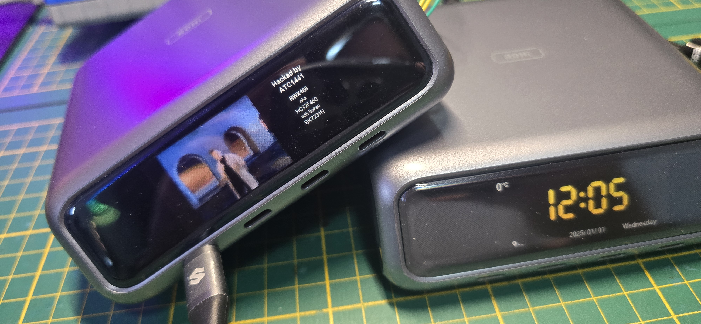
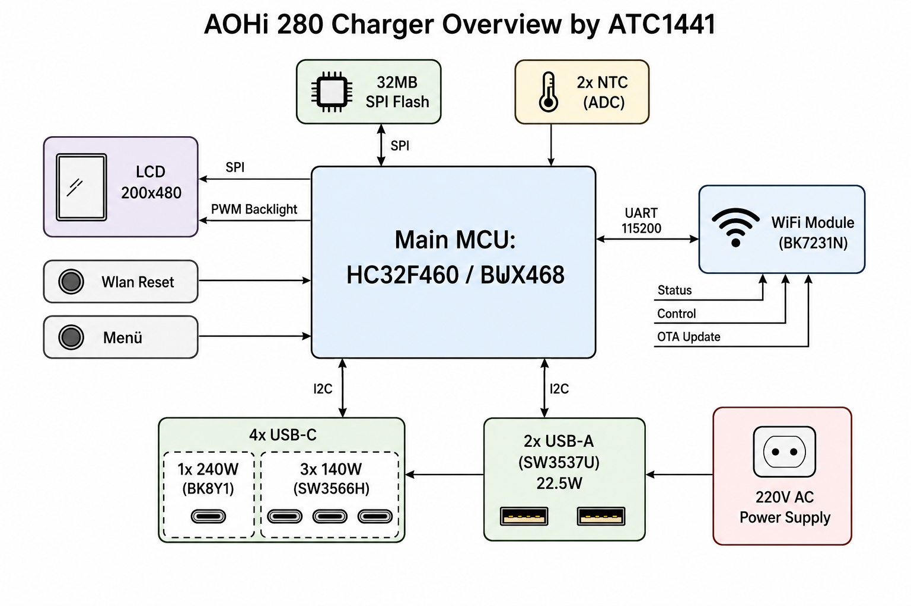

# AOHi 280W Charger - Hacking & Custom Firmware

Reverse‑engineering and a **custom firmware** for the **AOHi 280 W USB‑C desktop
charger** (6 ports, smart display). The stock display firmware was reverse‑engineered from its
image and reimplemented from scratch for the display MCU; the result runs on the real hardware in
place of the stock app, with the original UI/behaviour plus extras (on‑device debug page, a Watt
history graph, …).



➡️ **The firmware lives in [`AOHi_280_Firmware/`](AOHi_280_Firmware/)** - build with `make`,
flash with `flash.ps1` (J‑Link). See that folder's README for the full pinout, register map, and
flashing details.

---

## Hardware overview

The charger is built around a display/UI microcontroller that supervises a set of dedicated
USB‑PD charging controllers, an LCD, and a Wi‑Fi co‑processor, all fed by an internal mains PSU.

### Component summary

| Block | Part | Role |
|-------|------|------|
| **Main controller** | **HC32F460** (relabeled **"BWX468"**, Cortex‑M4F, 512 KiB flash, ~188 KiB RAM) | Runs everything: UI/display management, button handling, and supervision of the charging controllers over I²C. |
| **Image/asset flash** | 32 MB SPI‑NOR | UI assets (images / fonts) and log/OTA storage. |
| **Temperature** | 2× NTC thermistor | Monitors the power‑electronics temperature (read via the MCU's ADC). |
| **Display** | LCD **200×480** | Driven over SPI, with separate **PWM backlight** control. |
| **Buttons** | tactile buttons | Wi‑Fi reset and menu navigation. |
| **Wi‑Fi module** | **BK7231N** | UART link (115200 baud) to the MCU; enables status monitoring, remote control, and **OTA updates** of the firmware and the SPI flash. |
| **USB‑C ports** | 1× **BK8Y1** (240 W master) + 3× **SW3566H** (140 W each) | The PD source controllers, configured/monitored by the MCU over I²C. |
| **USB‑A ports** | 2× **SW3537U** (22.5 W each) | USB‑A PD/QC controllers. |
| **Power supply** | internal PSU | Transforms 220 V mains into the rails for all components. |

### How it fits together



- **C1 (240 W master, BK8Y1)** is on its own bit‑bang I²C bus (SCL=PC13, SDA=PF2, addr 0x16). It
  negotiates and holds the 20 V / 240 W contract; the MCU writes its power budget (reg3) and reads
  V/I telemetry.
- **C2/C3/C4 (SW3566H)** and the **0x78 config IC** share the "PDC" bit‑bang I²C bus (SCL=PB3,
  SDA=PB4); the USB‑A side is sensed via the config IC's ADC.
- A shared HV‑boost power stage feeds the bucks, gated by GPIOs (PB12 boost / PB10 low‑V / PB2 20 V).

See **[`AOHi_280_Firmware/README.md`](AOHi_280_Firmware/README.md)** for the complete GPIO pinout,
the charging‑IC → pin/address map, and the key I²C registers.

---

## UI assets & updates (external flash)

The UI graphics live on the **external 32 MB SPI‑NOR**, **not** in the MCU. They are stored
**RLE‑compressed** (run‑length encoded RGB565: an opcode byte whose high bit marks a *run* of N
pixels of one colour, else a literal run) and streamed flash → decoder → LCD at draw time
(`hal/render.c`). The firmware never holds a full framebuffer — it decodes each sprite on the fly.

**Both the firmware and the external images are updatable over the air** (Tuya‑style Wi‑Fi OTA via
the BK7231N, `app/ota.c`): an update bundle carries the firmware and/or the asset image with CRC32,
staged to **internal `0x38000`** (firmware → bootloader copies it to the app slot) and **external
`0x800000`** (assets → written to the SPI‑NOR). So you can reskin the UI or update logic without
opening the device.

The full UI image set extracted (RLE‑decoded) from the dump is in
**[`dumps/32mb_images_export/`](dumps/32mb_images_export/)** (871 sprites, named `*_idxNNN_WxH.png`).

## BLE provisioning tool (`aohi_ble_tool.html`)

A self-contained browser **WebBluetooth** tool (open in Chrome/Edge over HTTPS or `file://`) that
speaks the charger's **BK7231N `0x55AA` BLE protocol** (reverse-engineered from the firmware). With
it you can:

- **Set the Wi‑Fi connection** — scan for SSIDs (cmd `0x04`) and send the credentials (ConnectWiFi,
  cmd `0x05`); read device info (`0x01`), the current Wi‑Fi config (`0x09`), and the live connection
  status (`0x03`: fail / OK / cloud‑reg / ready).
- **Point the device at custom cloud URLs** — in principle, via SetCloudHost (cmd `0x10`). This only
  works against a server that presents a **real, registered HTTPS/SSL certificate**: there is **no
  certificate pinning** (so any domain is accepted), but the cert must be **CA‑signed and valid** —
  a self‑signed certificate is rejected, so you can't trivially redirect the device to a fake cloud.

The tool also has a generic command builder + raw‑hex sender and decodes the known reply frames.

## Repository layout

```
AOHi_280W_Charger_Hacking/
├── README.md                       # this overview
├── AOHI_Charger_BlockDiagram.png   # hardware block diagram
├── aohi_ble_tool.html              # browser BLE tool for the charger
├── AOHi_280_Firmware/              # the custom display firmware (build + flash here)
│   ├── README.md                   #   pinout, register map, build & flash
│   ├── Makefile, flash.ps1
│   ├── app/ hal/ lib/ mcu/ board/ device/   # firmware source
│   └── boot/                       #   optional bootloader reconstruction
└── dumps/                          # full hardware dumps + extracted assets
    ├── AOHi_internal_HC32F460_BWX468.hex   # MCU internal flash (boot + stock app + cfg)
    ├── AOHi_external_spiflash_32MB.bin      # external SPI-NOR (UI assets, RLE) + storage
    └── 32mb_images_export/                  # 871 UI sprites extracted (RLE-decoded) from the ext flash
```

## Status & safety notes

- The custom firmware runs on real hardware: display/UI, 6‑port PD telemetry, C1 20 V/240 W, Smart
  power distribution, Wi‑Fi companion link, debug + graph pages.
- Flashing replaces only the **internal MCU app** (`0x8000`). The external 32 MB asset chip is
  already populated on a real device - **leave it untouched**.
- The PD/charging ICs only fully reset on a **mains power‑cycle**, not a J‑Link reset.
- Mains‑powered device: only open/probe it if you know what you're doing.
